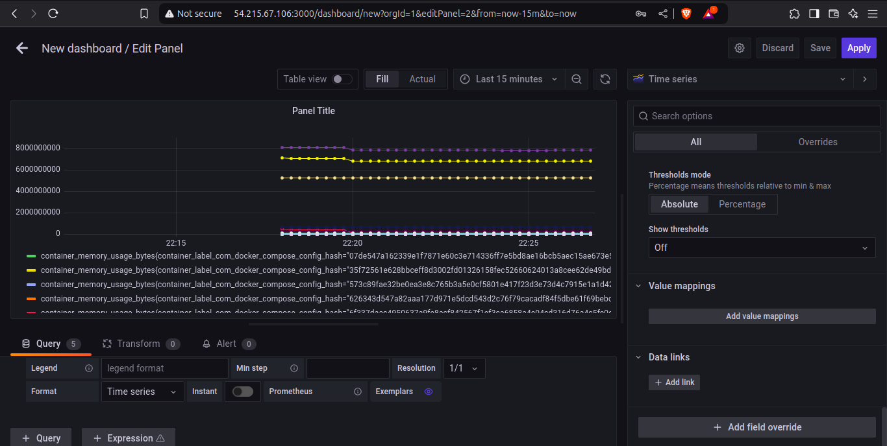

# Full-Stack FastAPI and React Template - DevOps Challenge Documentation

## Table of Contents
- [Project Overview](#project-overview)
- [Repository Structure](#repository-structure)
- [Deployment Code](#deployment-code)
  - [Docker Configurations](#docker-configurations)
  - [Application Code](#application-code)
  - [Monitoring Setup](#monitoring-setup)
  - [Deployment Scripts](#deployment-scripts)
- [Screenshots](#screenshots)

## Project Overview
This documentation contains all code and configurations used to deploy a full-stack FastAPI and React application with comprehensive monitoring.


## Repository Structure
```

├── frontend/
│   ├── Dockerfile
│   ├── package.json
│   └── src/
│   └── The rest of the files
├── backend/
│   ├── Dockerfile
│   ├── requirements.txt
│   └── app/
│   └── The rest of the files/
├── monitoring/
│   ├── prometheus-config.yml
│   ├── promtail-config.yml
│   └── loki-config.yml
├── docker-compose
├   ├── docker-compose.app.yml
│   ├── docker-compose.monitoring.yml


```

## Deployment Code

### Docker Configurations

#### 1. Frontend Dockerfile
```dockerfile
# Use an official Node.js base image (includes npm)
FROM node:16

# Set the working directory inside the container
WORKDIR /app
RUN chown -R node:node /app

# Copy package.json and package-lock.json first to leverage Docker's cache
COPY package*.json .

# Install the necessary dependencies (Vite and other dependencies)
RUN npm install

# Copy the rest of the frontend source code to the container
COPY . .

# Expose the port on which the frontend app will run
EXPOSE 5173

# Run the frontend app in development mode using Vite
CMD ["npm", "run", "dev", "--", "--host", "0.0.0.0"]
```

#### 2. Backend Dockerfile
```dockerfile
# Use a lightweight Python image
FROM python:3.10-slim

# Install system dependencies like curl and other required libraries
RUN apt-get update && \
    apt-get install -y \
    curl \
    build-essential \
    libpq-dev && \
    rm -rf /var/lib/apt/lists/*

# Set the working directory
WORKDIR /app

# Copy only necessary files for dependency installation first (to cache layers)
COPY pyproject.toml poetry.lock ./

# Install Poetry and add it to PATH in a single layer
RUN curl -sSL https://install.python-poetry.org | python3 - && \
    ln -s /root/.local/bin/poetry /usr/local/bin/poetry && \
    poetry config virtualenvs.create false


# Copy the rest of the application code
COPY . .

# Regenerate the lock file and install dependencies
RUN poetry lock && poetry install --no-root --no-interaction

# Add the application directory to PYTHONPATH
ENV PYTHONPATH=/app:$PYTHONPATH

# Ensure prestart.sh is executable
RUN chmod +x /app/prestart.sh

# Expose the port for FastAPI
EXPOSE 8000

# Default command runs the prestart.sh and then the server
CMD ["/bin/bash", "-c", "./prestart.sh && poetry run uvicorn app.main:app --host 0.0.0.0 --port 8000"]
```

#### 3. Application Stack Docker Compose
##### docker-compose.app.yml
```yaml
version: "3.8"
services:
  traefik:
    image: "traefik:v2.5"
    container_name: "traefik"
    command:
      - "--log.level=DEBUG"
      - "--api.insecure=false"
      - "--providers.docker=true"
      - "--providers.docker.exposedbydefault=false"
      - "--entrypoints.web.address=:80"
      - "--entrypoints.websecure.address=:443"
      - "--certificatesresolvers.letsencryptresolver.acme.httpchallenge=true"
      - "--certificatesresolvers.letsencryptresolver.acme.httpchallenge.entrypoint=web"
      - "--certificatesresolvers.letsencryptresolver.acme.email=citatech@proton.me"
      - "--certificatesresolvers.letsencryptresolver.acme.storage=/etc/traefik/acme.json"
    ports:
      - "80:80"
      - "443:443"
    networks:
      - app_network
      - monitoring
    volumes:
      - ./traefik/acme.json:/etc/traefik/acme.json
      - /var/run/docker.sock:/var/run/docker.sock
    labels:
      - "traefik.enable=true"
      # Dashboard
      - "traefik.http.routers.dashboard.rule=Host(`demo-domain.online`) && (PathPrefix(`/api/dashboard`) || PathPrefix(`/dashboard`))"
      - "traefik.http.routers.dashboard.service=api@internal"
      - "traefik.http.routers.dashboard.entrypoints=websecure"
      - "traefik.http.routers.dashboard.tls.certresolver=letsencryptresolver"
      - "traefik.http.routers.dashboard.middlewares=auth"
      - "traefik.http.middlewares.auth.basicauth.users=admin:$$apr1$$0s0j0dWJ$$Q1Z9Ul9tqExfjFSf5RgMR0"
      # ACME challenge
      - "traefik.http.routers.acme.rule=PathPrefix(`/.well-known/acme-challenge/`)"
      - "traefik.http.routers.acme.entrypoints=web"
      - "traefik.http.routers.acme.service=api@internal"
      - "traefik.http.routers.acme.tls=false"


  backend:
    build:
      context: ../backend
    ports:
      - "8000:8000"
    environment:
      - PROJECT_NAME=YourProjectName
      - POSTGRES_SERVER=postgres
      - POSTGRES_USER=myuser
      - POSTGRES_PASSWORD=mypassword
      - POSTGRES_DB=mydatabase
      - FIRST_SUPERUSER=admin@citatech.online
      - FIRST_SUPERUSER_PASSWORD=newpassword
      - BACKEND_CORS_ORIGINS=["http://localhost:5173/", "http://54.215.67.106:5173/", "http://demo-domain.online", "https://demo-domain.online"]
      - ENV_FILE_PATH=/app/.env
    volumes:
      - ../backend:/app
    depends_on:
      - postgres
    command: /bin/bash -c "./prestart.sh && poetry run uvicorn app.main:app --host 0.0.0.0 --port 8000"
    networks:
      - app_network
      - monitoring
    labels:
      - "traefik.enable=true"
      - "traefik.http.routers.backend.rule=Host(`demo-domain.online`) && PathPrefix(`/api`)"
      - "traefik.http.services.backend.loadbalancer.server.port=8000"
      - "traefik.http.routers.backend.entrypoints=websecure"
      - "traefik.http.routers.backend.tls.certresolver=letsencryptresolver"
      - "traefik.http.middlewares.backend-strip.stripprefix.prefixes=/api"
      - "traefik.http.routers.backend.middlewares=backend-strip"
     # Add support for Swagger docs at /docs
      - "traefik.http.routers.docs.rule=Host(`demo-domain.online`) && Path(`/docs`)"
      - "traefik.http.services.docs.loadbalancer.server.port=8000"
      - "traefik.http.routers.docs.entrypoints=websecure"
      - "traefik.http.routers.docs.tls.certresolver=letsencryptresolver"
      - "traefik.http.middlewares.docs-strip.stripprefix.prefixes=/api"
      - "traefik.http.routers.docs.middlewares=docs-strip"

  frontend:
    build:
      context: ../frontend
    ports:
      - "5173:5173"
    environment:
      - VITE_BACKEND_URL=https://demo-domain.online/api  # Changed to https
    volumes:
      - ../frontend:/app
      - /app/node_modules
    depends_on:
      - backend
    command: sh -c "chown -R node:node /app && npm run dev -- --host 0.0.0.0"
    networks:
      - app_network
      - monitoring
    labels:
      - "traefik.enable=true"
      - "traefik.http.routers.frontend.rule=Host(`demo-domain.online`)"
      - "traefik.http.services.frontend.loadbalancer.server.port=5173"
      - "traefik.http.routers.frontend.entrypoints=websecure"
      - "traefik.http.routers.frontend.tls.certresolver=letsencryptresolver"
      - "traefik.http.routers.frontend.priority=1" 

  postgres:
    image: postgres:14
    environment:
      - POSTGRES_USER=myuser
      - POSTGRES_PASSWORD=mypassword
      - POSTGRES_DB=mydatabase
    volumes:
      - postgres_data:/var/lib/postgresql/data
    ports:
      - "5432:5432"
    networks:
      - app_network
      - monitoring
    labels:
      - "traefik.enable=false"

  adminer:
    image: adminer:4.8.1
    container_name: "adminer"
    ports:
      - "8081:8080"
    labels:
      - "traefik.enable=true"
      - "traefik.http.routers.adminer.rule=Host(`demo-domain.online`) && PathPrefix(`/db`)"
      - "traefik.http.routers.adminer.entrypoints=websecure"
      - "traefik.http.routers.adminer.tls.certresolver=letsencryptresolver"
      - "traefik.http.services.adminer.loadbalancer.server.port=8080"  # Added this
    networks:
      - app_network

networks:
  app_network:
    driver: bridge
  monitoring:
    external: false  # Added this

volumes:
  postgres_data:
    driver: local
```

#### 4. Monitoring Stack Docker Compose
##### docker-compose.monitoring.yml
```yaml
version: '3.7'
services:
  prometheus:
    image: prom/prometheus:v2.34.0
    container_name: prometheus
    ports:
      - "9090:9090"
    expose:
      - "9090"
    command:
      - '--config.file=/etc/prometheus/prometheus.yml'
      - '--web.external-url=/prometheus'
    volumes:
      - ../monitoring/prometheus-config.yml:/etc/prometheus/prometheus.yml
    networks:
      - monitoring
      - app_network
    labels:
      - traefik.enable=true
      # HTTP Service
      - traefik.http.services.prometheus.loadbalancer.server.port=9090
      # HTTP Router ()
      - traefik.http.routers.prometheus-http.rule=(Host(`demo-domain.online`) && PathPrefix(`/prometheus`))
      - traefik.http.routers.prometheus-http.entrypoints=web
      # HTTP to HTTPS redirect
      - traefik.http.routers.prometheus-http.middlewares=https-redirect
      - traefik.http.middlewares.https-redirect.redirectScheme.scheme=https
      - traefik.http.middlewares.https-redirect.redirectScheme.permanent=true
      # HTTPS Router
      - traefik.http.routers.prometheus.rule=(Host(`demo-domain.online`) && PathPrefix(`/prometheus`))
      - traefik.http.routers.prometheus.entrypoints=websecure
      - traefik.http.routers.prometheus.tls.certresolver=letsencryptresolver
      - traefik.http.routers.prometheus.service=prometheus
    
      
  grafana:
    image: grafana/grafana:8.3.0
    container_name: grafana
    expose:
      - "3000"
    ports:
      - "3000:3000"

    environment:
      - GF_SECURITY_ADMIN_PASSWORD=admin
      - GF_SERVER_ROOT_URL=https://demo-domain.online/grafana
      - GF_SERVER_SERVE_FROM_SUB_PATH=true
    networks:
      - monitoring
      - app_network
    labels:
      - traefik.enable=true
      # HTTP Service
      - traefik.http.services.grafana.loadbalancer.server.port=3000
      # HTTP Router 
      - traefik.http.routers.grafana-http.rule=(Host(`demo-domain.online`) && PathPrefix(`/grafana`))
      - traefik.http.routers.grafana-http.entrypoints=web
      - traefik.http.routers.grafana-http.service=grafana
      # HTTP to HTTPS redirect
      - traefik.http.routers.grafana-http.middlewares=https-redirect
      - traefik.http.middlewares.https-redirect.redirectScheme.scheme=https
      - traefik.http.middlewares.https-redirect.redirectScheme.permanent=true
      # HTTPS Router
      - traefik.http.routers.grafana-https.rule=(Host(`demo-domain.online`) && PathPrefix(`/grafana`))
      - traefik.http.routers.grafana-https.entrypoints=websecure
      - traefik.http.routers.grafana-https.tls.certresolver=letsencryptresolver
      - traefik.http.routers.grafana-https.service=grafana
    
    depends_on:
      - loki

  loki:
    image: grafana/loki:2.3.0
    container_name: loki
    ports:
      - "3100:3100"
    volumes:
      - /var/log:/var/log
      - ../monitoring/loki-config.yml:/etc/loki/loki-config.yaml
    networks:
      - app_network
      - monitoring
    labels:  # Added Traefik labels for Loki
      - "traefik.enable=true"
      - "traefik.http.services.loki.loadbalancer.server.port=3100"
      - "traefik.http.routers.loki.rule=Host(`demo-domain.online`) && PathPrefix(`/loki`)"
      - "traefik.http.middlewares.loki-strip.stripprefix.prefixes=/loki"
      - "traefik.http.routers.loki.middlewares=loki-strip"
      - "traefik.http.routers.loki.entrypoints=websecure"
      - "traefik.http.routers.loki.tls.certresolver=letsencryptresolver"

  promtail:
    image: grafana/promtail:latest
    container_name: promtail
    volumes:
      - /var/log:/var/log  # Added volume for logs
      - ./promtail-config.yml:/etc/promtail/promtail-config.yaml
    networks:
      - app_network
      - monitoring
    depends_on:
      - loki

  cadvisor:
    image: google/cadvisor:latest  # Changed from canary to latest for stability
    container_name: cadvisor
    volumes:
      - /:/rootfs:ro
      - /var/run:/var/run:ro
      - /sys:/sys:ro
      - /var/lib/docker/:/var/lib/docker:ro
      - /dev/disk/:/dev/disk:ro
    networks:
      - app_network
      - monitoring
    labels:  # Added Traefik labels for cAdvisor
      - "traefik.enable=true"
      - "traefik.http.services.cadvisor.loadbalancer.server.port=8080"
      - "traefik.http.routers.cadvisor.rule=Host(`demo-domain.online`) && PathPrefix(`/cadvisor`)"
      - "traefik.http.middlewares.cadvisor-strip.stripprefix.prefixes=/cadvisor"
      - "traefik.http.routers.cadvisor.middlewares=cadvisor-strip"
      - "traefik.http.routers.cadvisor.entrypoints=websecure"
      - "traefik.http.routers.cadvisor.tls.certresolver=letsencryptresolver"

networks:
  app_network:
    external: true
  monitoring:
    driver: bridge
```


### Monitoring Setup

#### 1. Prometheus Configuration
##### monitoring/prometheus-config.yml
```yaml
global:
  scrape_interval: 15s

scrape_configs:
  - job_name: 'cadvisor'
    static_configs:
      - targets: ['cadvisor:8080']

  - job_name: 'promtail'
    static_configs:
      - targets: ['promtail:9080']  # Promtail should expose its metrics

  - job_name: 'backend'
    static_configs:
      - targets: ['backend:8000'] 

```

#### 2. Loki Configuration (loki/local-config.yml)
```yaml
auth_enabled: false

server:
  http_listen_port: 3100

ingester:
  lifecycler:
    address: 127.0.0.1
    ring:
      kvstore:
        store: inmemory
      replication_factor: 1
    final_sleep: 0s
  chunk_idle_period: 5m
  chunk_retain_period: 30s

schema_config:
  configs:
    - from: 2020-05-15
      store: boltdb
      object_store: filesystem
      schema: v11
      index:
        prefix: index_
        period: 168h

storage_config:
  boltdb:
    directory: /tmp/loki/index

  filesystem:
    directory: /tmp/loki/chunks

limits_config:
  enforce_metric_name: false
  reject_old_samples: true
  reject_old_samples_max_age: 168h
```

#### 3. Promtail Configuration
##### monitoring/promtail-config.yml
```yaml
server:
  http_listen_port: 9080
  grpc_listen_port: 0

positions:
  filename: /tmp/positions.yaml

clients:
  - url: http://loki:3100/loki/api/v1/push

scrape_configs:
- job_name: system
  static_configs:
  - targets:
      - "localhost"
    labels:
      job: varlogs
      __path__: /var/log/*log
```


## 2. Deployment The App
 - In order to deploy the app, we can run the command below
```docker
docker-compose -f docker-compose.app.yml -f docker-compose.monitoring.yml up --build
```


- Then confirm that all images have been built successfully and is running as ccontainers.  

```docker
docker images
docker ps
```


## Screenshots

### Infrastructure Setup
![Infrastructure Dashboard]
*Figure 1: Cloud infrastructure dashboard showing deployed resources*

### frontend on  `/`


### Backend on `/api`


### Prometheus on `/prometheus`


### Grafana on `/grafana`


### Swagger Docs on `/docs`


### Database  on `/db`


### Application Deployment
![Application Deployment]
*Figure 2: Successfully deployed application with all services running*


### Monitoring Dashboards
![Grafana Dashboard]
*Figure 3: Grafana dashboard showing system metrics*





![Prometheus Dashboard]
*Figure 4: Prometheus Dashboards


![Adminer]
*Figure 4: Adminer for Postgres


## Notes for Implementation:

1. Replace all environment variables with appropriate values
2. Ensure all configuration files are properly secured
3. Update domain names in Traefik labels
4. Add necessary SSL certificates
5. Set up proper authentication for monitoring tools

[End of documentation]
